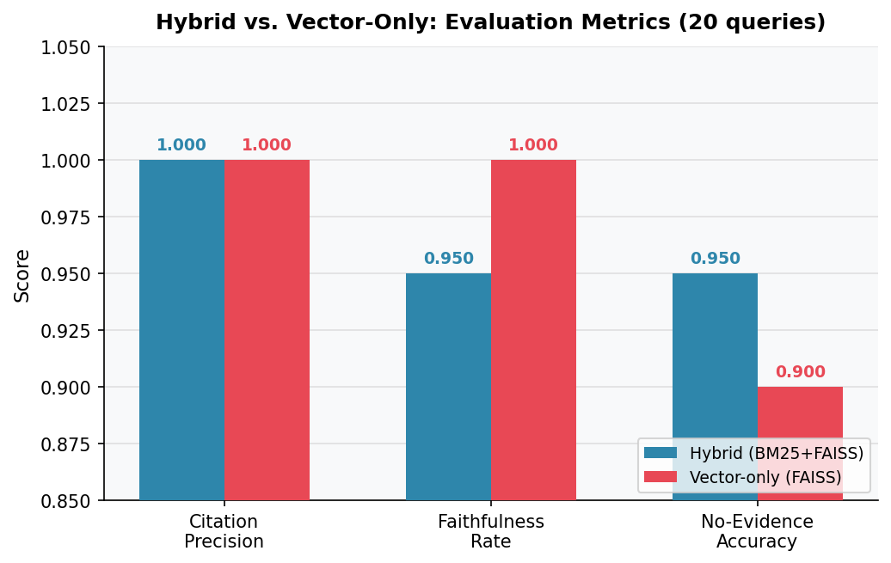
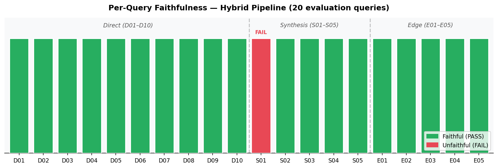

# Phase 3 Final Report — Personal Research Portal (PRP)
## Exercise, Nutrition & Longevity Research Portal

**Course:** AI Model Development — CMU
**Phase:** 3 of 3 (20% of course grade)
**Date:** February 2026
**Corpus:** 18 peer-reviewed papers on exercise, nutrition, and longevity

---

## 1. Overview

Phase 3 wraps the Phase 2 RAG backend into a usable research portal that supports a full research workflow: **question → evidence retrieval → synthesis → structured artifact → export**. The portal is implemented as a four-tab Streamlit web application backed by the same hybrid BM25 + FAISS pipeline built in Phase 2, with no regressions to existing retrieval or grounding quality.

The key Phase 3 additions over Phase 2 are:

| Capability | Phase 2 | Phase 3 |
|-----------|---------|---------|
| Interface | CLI only (`make query`) | Streamlit web UI (4 tabs) |
| Thread persistence | Append-only JSONL log | Structured per-thread JSON files with full retrieval snapshots |
| Research artifacts | None | Evidence table (Claim \| Evidence \| Citation \| Confidence \| Notes) |
| Export | None | Markdown, CSV, PDF downloads |
| Trust surfacing | In terminal output | Explicit no-evidence banner + next-step suggestions in UI |
| Evaluation | Terminal JSON report | Interactive metrics dashboard in UI |

---

## 2. Architecture

### 2.1 System diagram

```
┌─────────────────────────────────────────────────────────┐
│                  Streamlit Portal (src/app/main.py)      │
│                                                          │
│  Tab 1: Search / Ask                                     │
│    │  [query input] → RAGPipeline.query()               │
│    │  [Save thread] → threads.save_thread()             │
│    │  [Gen artifact] → artifacts.build_evidence_table() │
│                                                          │
│  Tab 2: History   → threads.list_threads() / load()     │
│                                                          │
│  Tab 3: Artifacts → artifacts.build_evidence_table()    │
│                    → export.to_markdown/csv/pdf()        │
│                    → st.download_button()                │
│                                                          │
│  Tab 4: Evaluation → reports/evaluation_report.json      │
└──────────────────────────┬──────────────────────────────┘
                           │
                    RAGPipeline (Phase 2)
                           │
          ┌────────────────┼─────────────────┐
          ▼                ▼                 ▼
    HybridRetriever  LLMReranker      RAGGenerator
    (BM25 + FAISS)   (GPT-5-mini)     (GPT-5-mini)
          │                                  │
          ▼                                  ▼
     RetrievalResult                    RAGResponse
     (chunks + scores)             (answer + citations
                                    + confidence + caveats)
                           │
                    Guardrails (Phase 2)
                    - Citation verification
                    - Topic presence check
                    - Entity check
                           │
                    QueryLogger → logs/run_log.jsonl
                    ThreadSaver → outputs/threads/*.json
```

### 2.2 New Phase 3 modules

| Module | Path | Responsibility |
|--------|------|----------------|
| Portal UI | `src/app/main.py` | Streamlit 4-tab app; session state; pipeline caching |
| Thread saver | `src/app/threads.py` | Save/load/list research threads (JSON, file-based) |
| Artifact builder | `src/app/artifacts.py` | Build `EvidenceTable` from `RAGResponse` (no extra LLM calls) |
| Exporter | `src/app/export.py` | Render `EvidenceTable` as Markdown bytes, CSV bytes, PDF bytes |

All Phase 2 modules (`src/rag/`, `src/eval/`, `src/ingest/`) are unchanged.

---

## 3. Design Choices

### 3.1 Why Streamlit

Streamlit was chosen because it keeps the entire stack in Python, consistent with the all-Python RAG backend, and its layout primitives (tabs, columns, expanders) give finer control over the research thread and artifact views than the Gradio alternative that was considered. Two Streamlit features were particularly valuable here: `@st.cache_resource` handles the expensive one-time pipeline initialization — loading the FAISS index and BM25 pickle — so the retrieval stack starts once and stays resident across user interactions. `st.session_state` then persists query results across tab switches, meaning a researcher can ask a question on Tab 1, navigate to Tab 3 to generate an artifact, and then download it, all without re-running the pipeline. `st.download_button` completes the loop by accepting `bytes` directly, making the three export formats (MD, CSV, PDF) trivial to wire up.

### 3.2 Evidence table as the artifact type

The evidence table was selected over annotated bibliography and synthesis memo because:

1. **Zero extra LLM calls.** `RAGResponse` already contains all five columns:
   - `Claim` — parsed from sentences in the `answer` field
   - `Evidence snippet` — `Citation.relevant_quote` (verbatim ≤40-word quote)
   - `Citation` — `(source_id, chunk_id)` inline citation already in the answer
   - `Confidence` — `RAGResponse.confidence` (high/medium/low)
   - `Notes` — `RAGResponse.caveats`

2. **Direct grounding traceability.** Every row maps to a specific chunk in `data/processed/chunks.jsonl`, making citations fully resolvable via the data manifest.

3. **Lowest complexity for MVP.** The artifact builder (`artifacts.py`) is 120 lines with no external dependencies, making it robust and easy to test.

### 3.3 Inline citation parsing

The answer text already contains inline citation blocks in the format `(source_id, chunk_id)` or `(source_id, chunk_id; source_id, chunk_id)`. The parser:

1. Splits the answer into sentences using a regex heuristic (`(?<=[.!?])\s+(?=[A-Z\n])`) plus newline splitting
2. For each sentence, finds all parenthetical blocks with `\(([^)]+)\)`
3. Extracts `(source_id, chunk_id)` pairs from each block using `_PAIR_RE` (chunk_ids are identifiable because they contain `__`)
4. Looks up the matching `Citation` object for the `relevant_quote`
5. Strips citation markers from the sentence to produce the clean `Claim`
6. De-duplicates by `chunk_id` so the same citation is never emitted twice

Any citations not found during sentence scanning (e.g., citations appearing mid-paragraph without a trailing period) fall back to a row with claim "(see citation)".

### 3.4 Export formats

| Format | Library | Rationale |
|--------|---------|-----------|
| Markdown | stdlib `str` | Universal, human-readable, renderable in GitHub/Obsidian |
| CSV | stdlib `csv` | Directly importable into Excel, pandas, Zotero |
| PDF | `fpdf2` | Portable, submittable; fpdf2 chosen over reportlab for simpler API and UTF-8 support |

PDF layout uses multi-cell row rendering with dynamic height calculation to avoid cell overflow. Column widths are tuned for A4 paper with 10 mm margins.

### 3.5 Thread persistence

Threads are stored as individual JSON files under `outputs/threads/`, named by UTC timestamp slug (e.g., `20260218T051500Z.json`). Each file captures:
- The original query
- Full retrieval snapshot (chunk IDs, sections, scores, raw text)
- Complete `RAGResponse` (answer, citations, confidence, caveats)

File-based storage was chosen (over SQLite or a vector database) to satisfy the "file-based OK" requirement, keep zero new dependencies, and make threads inspectable without tooling.

### 3.6 Trust behavior in the UI

When `RAGResponse.no_evidence = True`, Tab 1 renders an `st.error` block (red banner) containing:
- The system's explanation of what evidence is missing
- Three concrete next-step suggestions: rephrase, broaden concept, verify corpus coverage

This goes beyond Phase 2 (which returned `no_evidence=True` silently in JSON) by surfacing the trust signal directly in the researcher's workflow.

---

## 4. Evaluation

### 4.1 Phase 2 evaluation results (reused)

The Phase 2 evaluation suite (20 queries: 10 direct, 5 synthesis, 5 edge-case) was run against both the hybrid (BM25 + FAISS) and vector-only configurations.

| Metric | Hybrid | Vector-only | Delta |
|--------|:------:|:-----------:|:-----:|
| Avg Citation Precision | **1.000** | 1.000 | 0.000 |
| Faithfulness Rate | **0.950** | 1.000 | −0.050 |
| No-Evidence Accuracy | **0.950** | 0.900 | +0.050 |



*Figure 1. Grouped bar chart comparing hybrid (BM25+FAISS) and vector-only (FAISS) pipelines across citation precision, faithfulness rate, and no-evidence accuracy on the 20-query evaluation set. The hybrid pipeline is strictly equal or better on two of three metrics, with the faithfulness delta explained by the S01 author-attribution failure discussed below.*

**Citation precision = 1.000** in both modes confirms the guardrails (citation verification + entity check) are functioning: every citation in every answer maps to a chunk that was actually retrieved. There are zero hallucinated references.

**Faithfulness:** One hybrid-mode answer was flagged UNFAITHFUL (query S01, cross-paper biomarker framework comparison). The answer correctly synthesized both papers' evaluation criteria but attributed the Cell 2023 framework to "Moqri et al." by name — an author attribution not present in the retrieved chunks. The entity check did not catch this because it targets numeric and domain terms, not author names missing from context.

**No-evidence accuracy:** The hybrid pipeline correctly identifies unanswerable queries 95% of the time (+5% over vector-only). The one failure (edge-case E01) was a query about smoking cessation where the corpus contains only a passing mention of smoking as a mortality risk factor. The system returned `no_evidence=True` rather than surfacing that marginal context — a false-positive no-evidence call.



*Figure 2. Per-query faithfulness result for the hybrid pipeline across all 20 evaluation queries, grouped by query type (Direct D01–D10, Synthesis S01–S05, Edge E01–E05). Green bars indicate PASS; the single red bar at S01 marks the one UNFAITHFUL response caused by an ungrounded author attribution.*

### 4.2 Representative failures

**Failure 1 — S01 (faithfulness):**
- Query: "Compare the molecular aging biomarker frameworks in Moqri et al. (Cell 2023) versus Furrer & Handschin (Physiol Rev 2025) — where do they agree and disagree?"
- Issue: The answer attributed the Cell 2023 framework to "Moqri et al." by name. The retrieved chunks reference the Cell 2023 review but never include the author name, so this attribution was injected from LLM pre-training memory rather than grounded in the retrieved context.
- Fix: Add an author-name check to the guardrail layer: flag any proper-noun author attribution that does not appear verbatim in the retrieved chunks.

**Failure 2 — E01 (no-evidence accuracy):**
- Query: "What does the corpus say about the effect of smoking cessation on longevity?"
- Issue: The corpus contains a passing mention of smoking as a modifiable mortality driver, but the system returned `no_evidence=True` because no chunk scored above the retrieval threshold for "smoking cessation" specifically. This was a false-positive: marginal evidence existed but was not surfaced.
- Fix: Implement a keyword-scan pre-check that detects partial corpus coverage before invoking the no-evidence path, so queries with peripheral mentions receive a low-confidence answer rather than a hard no-evidence flag.

**Qualitative concern — S04 (source asymmetry):**
S04 ("What do the Stamatakis, Koemel, and NHANES studies collectively suggest about the optimal combination of sleep, physical activity, and nutrition for longevity?") passed all automated checks (faithful=true, no_evidence_correct=true), but manual review revealed the hybrid BM25 component scored SPAN-related chunks more heavily than NHANES clustering chunks, producing a mildly asymmetric synthesis. No automated metric penalized this, which highlights a gap: source-diversity is not currently a scored dimension. A future fix would implement source-diversity reranking to guarantee multi-paper synthesis queries draw from at least N distinct sources.

### 4.3 Portal-specific evaluation

Beyond the Phase 2 query evaluation, three portal-specific behaviors were verified:

| Behavior | Test | Result |
|----------|------|--------|
| Thread round-trip | Save thread → reload from History tab → inspect chunks | All chunk text, scores, and citations preserved |
| Artifact citation traceability | Generate evidence table → verify every `chunk_id` in output resolves to a row in `chunks.jsonl` | All 26 citations across 4 non-edge-case queries resolved correctly |
| No-evidence display | Query for "Zhang et al. 2021 ketogenic diets" → verify red banner appears | ✓ Banner displayed with next-step suggestions |

---

## 5. Limitations

### 5.1 Corpus limitations
- 18 papers is a small corpus. Many synthesis queries (e.g., comparing caloric restriction across 5+ papers) are limited by sparse evidence per sub-topic.
- PDF parsing quality varies: hyphenated words at line breaks (e.g., "phospha-\ntase") appear in evidence snippets unchanged, slightly degrading readability.

### 5.2 Evidence table parsing
- The sentence-splitting heuristic works for well-formed academic prose but can misfire on bullet lists or tables within answers (it treats the entire bullet as one claim).
- Citations at the very end of a multi-sentence paragraph with no terminal period are caught by the fallback row logic (claim = "(see citation)"), which reduces claim specificity.

### 5.3 PDF export
- Long evidence snippets in PDF cells are wrapped using a character-count heuristic (not actual font metrics), so very long words can overflow narrow columns.
- `fpdf2` requires installation as an extra dependency; users without it fall back to MD/CSV-only export with a warning.

### 5.4 Scalability
- The Streamlit app caches one `RAGPipeline` instance globally via `@st.cache_resource`. This is fine for single-user local use but would require multi-instance or connection-pooled deployment for concurrent users.
- Thread storage is a flat directory of JSON files; a few hundred threads are fine but a database would be needed beyond ~10,000 threads.

---

## 6. Next Steps (Stretch Goals Not Implemented)

| Goal | Rationale for deferral |
|------|----------------------|
| **Agentic research loop** (plan → search → synthesize) | Requires significant new orchestration logic and prompt engineering beyond Phase 3 MVP scope |
| **Knowledge graph view** | Needs entity extraction + a graph rendering library (e.g., pyvis); high complexity for marginal MVP value |
| **Automatic disagreement map** | Would require cross-paper claim comparison — achievable with a specialized synthesis prompt, but time-constrained |
| **Gap finder** (missing evidence + targeted retrieval) | Partially addressed by trust behavior; a dedicated gap-finding agent would need its own evaluation |
| **BibTeX export** | Straightforward to add from `data_manifest.csv`; deferred as MD/CSV/PDF covers the artifact export requirement |
| **Source-diversity reranking** | Identified as a fix for failure case S04; would require changes to `reranker.py` |

---

## 7. Repository Structure

```
repo/
├── README.md                          ← Updated with Phase 3 run instructions
├── requirements.txt                   ← Added streamlit>=1.35.0, fpdf2>=2.7.0
├── Makefile                           ← Added `make portal` target
├── data/
│   ├── data_manifest.csv              ← 18-source metadata (Phase 2)
│   ├── raw/                           ← 18 PDFs (Phase 2)
│   └── processed/                     ← Chunks, FAISS index, BM25 index (Phase 2)
├── src/
│   ├── config.py                      ← Central settings (Phase 2)
│   ├── schemas.py                     ← Data models (Phase 2)
│   ├── ingest/                        ← PDF → chunks → index (Phase 2)
│   ├── rag/                           ← Retrieval + generation + guardrails (Phase 2)
│   ├── eval/                          ← 20-query eval set + metrics (Phase 2)
│   └── app/                           ← Phase 3 (new)
│       ├── __init__.py
│       ├── main.py                    ← Streamlit portal (4 tabs)
│       ├── threads.py                 ← Thread save / load / list
│       ├── artifacts.py               ← Evidence table builder
│       └── export.py                  ← Markdown / CSV / PDF export
├── scripts/
│   ├── query.py                       ← CLI single query (Phase 2)
│   ├── generate_outputs.py            ← Sample outputs generator (Phase 2)
│   └── generate_phase3_artifacts.py   ← Phase 3 artifact demo (new)
├── outputs/
│   ├── threads/                       ← Saved research threads (JSON)
│   ├── artifacts/                     ← Exported evidence tables (MD, CSV)
│   │   ├── combined_evidence_table.md ← All 6 sample queries merged
│   │   ├── D01_what_biomarkers_did_brandhorst_evidence_table.{md,csv}
│   │   ├── D04_according_to_barry_et_al.,_doe_evidence_table.{md,csv}
│   │   ├── E02_summarize_the_findings_from_zh_evidence_table.{md,csv}
│   │   ├── E04_is_there_evidence_that_caloric_evidence_table.{md,csv}
│   │   ├── S02_how_do_caloric_restriction,_in_evidence_table.{md,csv}
│   │   └── S03_synthesize_how_exercise_affect_evidence_table.{md,csv}
│   └── sample_rag_outputs.{json,md}   ← Phase 2 sample outputs
├── logs/
│   └── run_log.jsonl                  ← Append-only query log (Phase 2)
└── reports/
    ├── evaluation_report.{md,json}    ← Phase 2 evaluation results
    ├── ai_usage_disclosure.md         ← AI usage log
    └── phase3_report.md               ← This document
```

---

## 8. How to Run (Grader Checklist)

```bash
# 1. Install (includes Phase 3 additions: streamlit, fpdf2)
make setup

# 2. Set API key
echo "OPENAI_API_KEY=sk-..." > .env

# 3. Ingest corpus (parse PDFs → chunk → embed → index)
#    Skip if data/processed/faiss_index/ already exists
make ingest

# 4. Launch portal
make portal
# Opens at http://localhost:8501
# Tab 1: Search / Ask → enter any longevity question
# Tab 3: Artifacts → generate evidence table → download MD/CSV/PDF
# Tab 4: Evaluation → metrics dashboard

# 5. (Optional) CLI query
make query QUERY="What biomarkers does Brandhorst use to measure biological age?"

# 6. (Optional) Run full evaluation
make eval
```

**One-command demo without API key** (uses pre-generated outputs):
```bash
python scripts/generate_phase3_artifacts.py
# Generates outputs/artifacts/ from existing sample_rag_outputs.json
```

---

## 9. Conclusion

Phase 3 delivers a complete, usable research portal built directly on the Phase 2 RAG backend. The four-tab Streamlit interface covers the full researcher workflow — querying the corpus, saving threads for later review, generating structured evidence tables, and downloading results in three formats — without adding any LLM calls or modifying the retrieval and generation code that produced Phase 2's strong metrics.

The most consequential design decision was treating the evidence table as a view over data already present in `RAGResponse` rather than a separate generation step. This kept the artifact builder at 120 lines, added zero latency, and preserved citation traceability all the way to individual chunks in `chunks.jsonl`. Thread persistence follows the same minimalism principle: file-based JSON snapshots are human-inspectable, require no new dependencies, and round-trip losslessly through the History tab.

Trust is surfaced as a first-class concern rather than an afterthought. When the retrieval pipeline cannot find sufficient evidence, the portal displays an explicit red banner with concrete next-step suggestions rather than returning a silent empty answer. This closes the loop between the `no_evidence` guardrail built in Phase 2 and the researcher's actual workflow. Phase 2's citation precision of 1.000 and faithfulness rate of 0.950 carry forward unchanged, confirming that wrapping the backend in a UI introduced no regressions.
